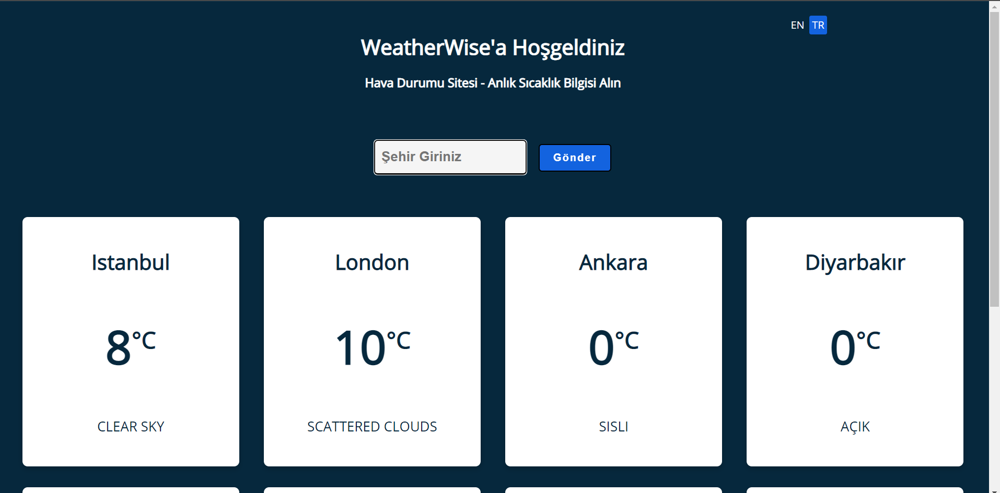

# WeatherWise

# Weather Site - getting instant temperature information

## Project About:
Simple site that u can see the temperature which city u want to learn.  
What are u waiting for? 
Start with your current location! 
 

## Live Demo: 
- https://azmideliaslan.github.io/WeatherWise/

## Other Links:
- https://medium.com/@azmideliaslan/weatherwise-learn-how-to-make-basic-weather-site-df397e6f66eb

## Future Plans
- adding bg image or gif to cards according to weather info
- adding dark/light mode
- maybe the time of that city

## Changelog v1.0.0

### New Features
- You can delete the cities you added
- The country code was placed next to the city

### Bug Fixes
- Adding same city name bug fixed

### Other Changes
- Delete button added and style impv.
- Country code style impv.

## Changelog v0.8.0

### New Features
- Allows users to change language between en and tr
- Improved the performance of the application by optimizing the code.
- The tempeture now is Celcius

### Bug Fixes
- When we click "enter" at the input area, it didn t  submit before, it fixed

### Other Changes
- if city name not valid, alert will occure that which language u are at
- First main paragraph rewrited
- Improved some css code

## First Commit - v0.7.0
### The site published in github

More about openweather usage:
https://openweathermap.org/current